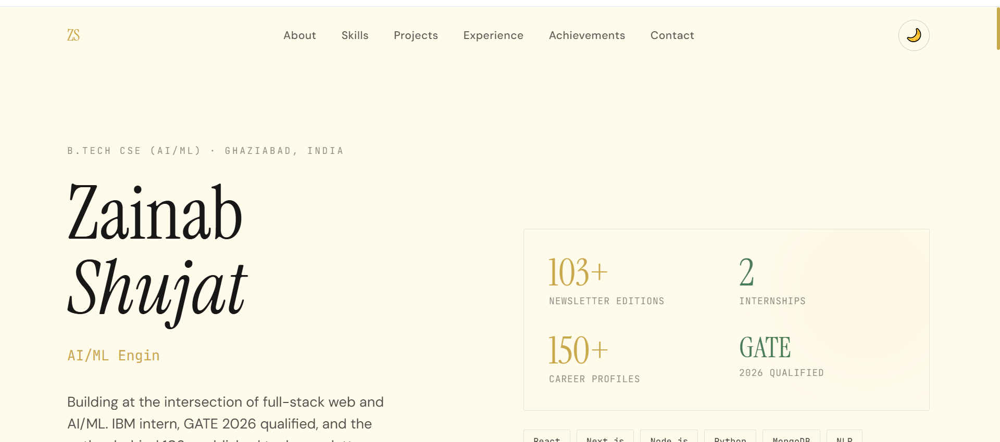
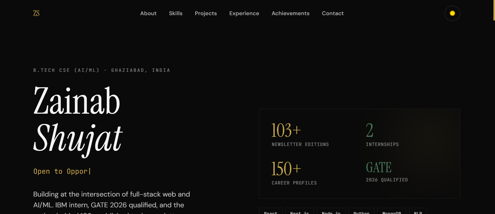
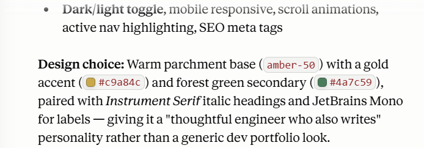

# Day 10 – Personal Portfolio Website 

## Objective

Build and deploy a personal portfolio website using AI-assisted development while reflecting on personal branding and online presence.

---
## Live link : 
---
## What I Did

For today's challenge, I used AI to generate a personal portfolio website based on my resume and professional profile.

The portfolio included:

* Hero section
* About Me section
* Skills showcase
* Featured projects
* Experience timeline
* Achievements and certifications
* Contact section
* Dark/Light mode support
* Responsive design

I deployed the portfolio using GitHub Pages and explored multiple design directions before finalizing a version.

---

## Key Learning

I expected today's challenge to be primarily about web development.

Instead, it became an exercise in personal branding.

One of the most interesting moments was seeing how the AI interpreted my resume. Rather than generating the stereotypical dark, neon developer portfolio, it suggested an editorial-style design with warm colors, serif typography, and a stronger emphasis on writing and long-form content.

Its reasoning was that my profile reflects not only a software builder, but also someone who writes, researches, documents, and teaches through content.

That led to an important realization:

> Personal branding is not just what you say about yourself. It is the impression people form before they read a single word.

The design of a portfolio communicates identity just as much as the projects listed on it.

---

## Technologies Used

* HTML
* Tailwind CSS
* JavaScript
* Claude (AI-assisted generation)
* GitHub Pages

---
## Screenshots 

---
## Deliverables

* AI-generated portfolio website
* Portfolio screenshots
* GitHub Pages deployment
* LinkedIn reflection post

---

## Reflection

A portfolio is often viewed as a collection of projects and achievements.

Today's challenge reminded me that it is also a storytelling tool.

The most effective portfolio is not necessarily the one with the most animations or the most projects. It is the one that accurately represents the person behind it.

For me, that meant balancing software engineering, AI/ML, and technical writing into a single narrative.

Day 10 completed ✅
