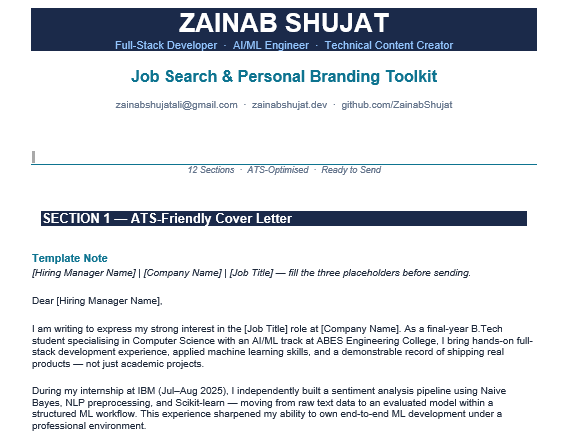
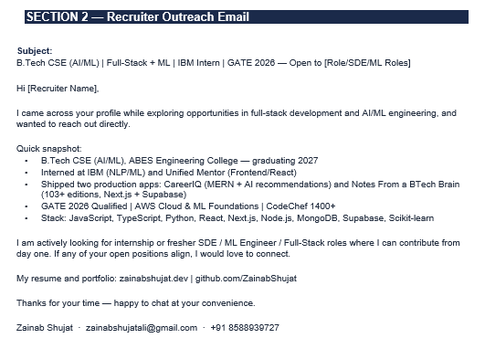
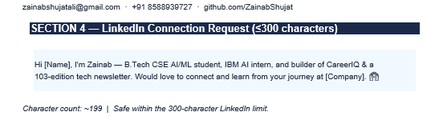
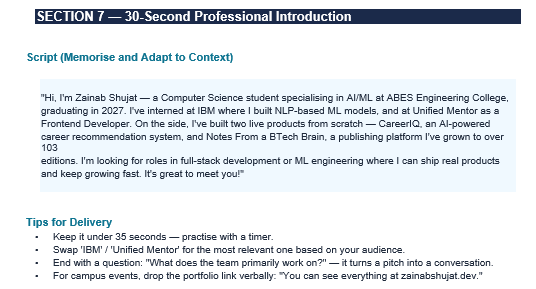
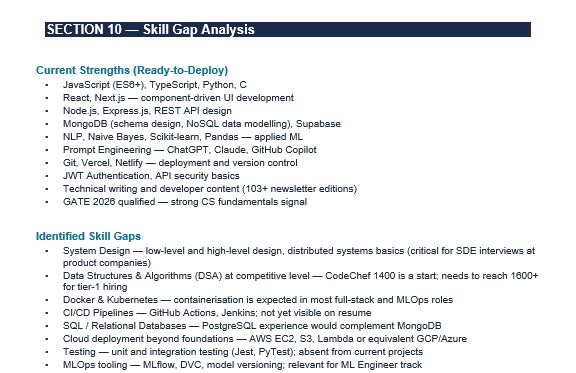
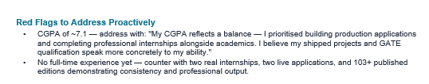
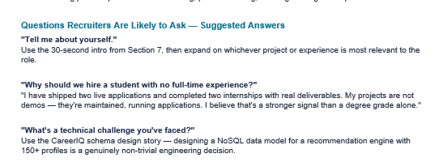

# Day 12 - Job Search & Personal Branding Toolkit

## Overview

Today's challenge focused on building a complete job search and personal branding system using Claude.

Rather than creating a traditional resume-only approach, the goal was to generate recruiter-facing assets, networking templates, interview preparation material, and a personal brand strategy that can be used throughout the job search process.

---

## Deliverables Created

### 1. ATS-Friendly Cover Letter

A recruiter-focused cover letter highlighting projects, internships, technical skills, certifications, and measurable achievements.

### 2. Recruiter Outreach Email

A concise email template designed for recruiter outreach and networking opportunities.

### 3. Hiring Manager Email

A personalized message for direct outreach to hiring managers.

### 4. LinkedIn Connection Requests

Multiple connection request templates tailored for recruiters, engineers, and technical professionals.

### 5. Referral Request Template

A professional referral request message emphasizing technical accomplishments and project experience.

### 6. Follow-Up Email

A reusable follow-up template for applications and networking conversations.

### 7. Professional Introduction

A 30-second elevator pitch for interviews, networking events, and career fairs.

### 8. Target Job Role Analysis

Identified the most suitable technical roles based on current skills, projects, internships, and interests.

### 9. Recruiter Strength Assessment

Highlighted the strengths most likely to attract recruiter attention.

### 10. Skill Gap Analysis

Evaluated current strengths, missing skills, and areas requiring improvement for software engineering and AI/ML roles.

### 11. Personal Brand Positioning

Created a professional positioning statement, value proposition, and recruiter-friendly headline options.

### 12. Interview Preparation Toolkit

Prepared STAR-format stories, achievement highlights, and responses to common recruiter concerns.

---

---

## Key Learnings

* Modern hiring extends beyond resumes and includes networking, branding, communication, and visibility.
* Quantified achievements create stronger impact than generic descriptions.
* Recruiters value demonstrated project ownership and real-world outcomes.
* A strong portfolio becomes significantly more powerful when paired with effective outreach.
* Personal branding can help differentiate candidates with similar technical backgrounds.

---

## Areas Identified for Improvement

* Data Structures & Algorithms
* System Design Fundamentals
* Docker & Containerization
* CI/CD Pipelines
* Testing Frameworks
* Advanced Cloud Deployment
* MLOps Tooling

---

## Reflection

The biggest takeaway from this exercise was understanding that technical skills alone are not enough. Positioning, communication, networking, and storytelling play a major role in creating career opportunities.

This toolkit provides reusable assets that can support future internship, placement, and full-time job applications.

#60DayClaudeChallenge
