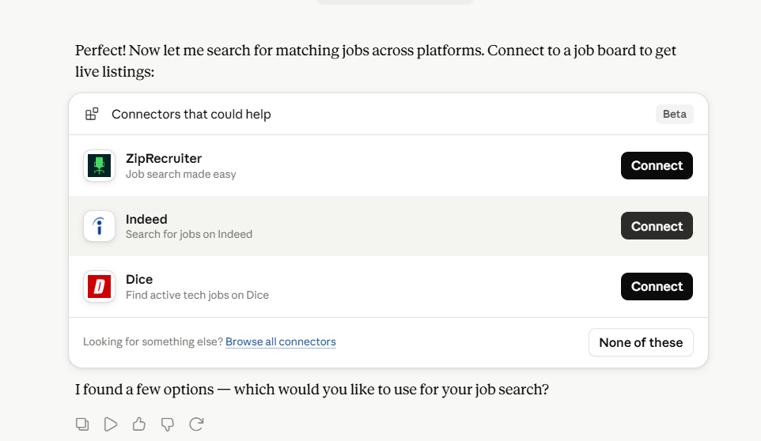
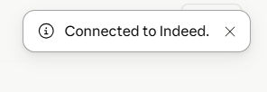
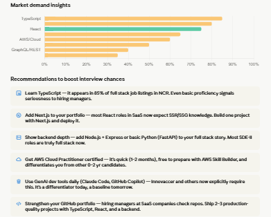
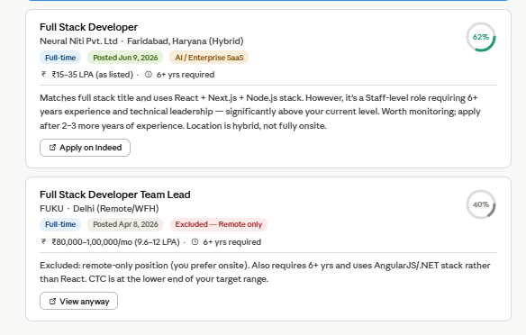

# Day 13 — AI-Powered Job Search & Professional Profile Analysis

## Professional Profile

| Field | Details |
|---|---|
| Role | Software Engineer / Full Stack Developer |
| Experience | 0–2 years |
| Industry | Tech / SaaS |
| Company Type | Mid-size company |
| Location | Delhi NCR, India |
| Key Skills | React, JavaScript, CSS, Full Stack Development |

---

## Job Search Criteria

| Criteria | Value |
|---|---|
| Target Titles | Full Stack Developer, Software Engineer |
| Work Mode | Onsite |
| Location | Delhi NCR (Delhi, Noida, Gurugram, Faridabad) |
| Target CTC | 10–15 LPA |
| Job Type | Full-time |
| Platform Used | Indeed (via Claude MCP connector) |

---

## Discovered Opportunities

| # | Company | Role | Location | Posted | Match Score | CTC (Est.) | Apply Link |
|---|---|---|---|---|---|---|---|
| 1 | Innovaccer | SDE-II (AI Frontend) | Noida, UP | Jun 8, 2026 | 78% ⭐ Best Fit | 12–18 LPA (est.) | [Apply](https://to.indeed.com/aacdr9y8zt47) |
| 2 | Neural Niti Pvt. Ltd | Full Stack Developer | Faridabad, Haryana | Jun 9, 2026 | 62% | 15–35 LPA | [Apply](https://to.indeed.com/aavks4ymzfrx) |
| 3 | FUKU | Full Stack Developer Team Lead | Delhi (Remote) | Apr 8, 2026 | 40% ❌ Excluded | 9.6–12 LPA | [View](https://to.indeed.com/aaxymv4fybhw) |

> FUKU was excluded because it is a remote-only role and requires 6+ years of experience with an AngularJS/.NET stack, which does not align with the job search criteria.

---

## Analysis

### Skills in Demand (Across All Listings)

| Skill | In Demand | I Have It |
|---|---|---|
| TypeScript | ✅ 85% of listings | ❌ Gap |
| Node.js | ✅ 80% | ❌ Gap |
| React | ✅ 75% | ✅ Yes |
| Next.js | ✅ 65% | ❌ Gap |
| AWS / Cloud | ✅ 60% | ❌ Gap |
| Python (basic) | ✅ 50% | ❌ Gap |
| REST / GraphQL APIs | ✅ 40% | ❌ Gap |
| Docker / CI-CD | ✅ 35% | ❌ Gap |
| JavaScript / ES6+ | ✅ 75% | ✅ Yes |
| Full Stack | ✅ 70% | ✅ Yes |

### Skill Gap Summary
- **Critical gaps:** TypeScript, Next.js, Node.js
- **Good to have:** AWS Cloud Practitioner, Python basics, Docker
- **GenAI tooling** (Claude Code, GitHub Copilot) now explicitly required at companies like Innovaccer

### CTC Reality Check
- 0–2 years experience → realistic NCR SaaS market range is **6–10 LPA**
- 10–15 LPA target is achievable in **12–18 months** with TypeScript + Next.js + cloud certification

---

## Recommendations

1. **Learn TypeScript** — appears in 85% of listings; high impact, ~4–6 weeks to get proficient
2. **Add Next.js** — most React roles now expect SSR/SSG; build one deployed project
3. **Show backend depth** — add Node.js + Express or Python (FastAPI) to round out full stack story
4. **Get AWS Cloud Practitioner certified** — quick win (1–2 months), differentiates you vs. peers
5. **Use GenAI tools daily** — Claude Code, GitHub Copilot now expected in modern SaaS roles
6. **Strengthen GitHub portfolio** — 2–3 production-quality projects with TypeScript + React + backend

---

## Key Learnings

- **AI-powered job matching** using Claude + Indeed MCP connector can surface and score opportunities against a personal profile automatically, saving hours of manual searching.
- **Profile–market alignment matters** — even strong React skills alone aren't enough; TypeScript and backend depth are now baseline expectations for full stack SaaS roles.
- **Experience gap is the biggest blocker** for 10–15 LPA — most onsite NCR roles at that range expect 3–6 years. Targeting early-stage startups and product companies over services firms can bridge this faster.
- **Recency of postings matters** — Innovaccer (Jun 8) and Neural Niti (Jun 9) were the freshest listings, meaning competition is lower. Applying within 48–72 hours of posting significantly improves response rates.
- **MCP connectors in Claude** enable agentic workflows: profile elicitation → job search → gap analysis → recommendations, all in one conversation without switching tabs.

---

## Screenshots

---

*Submitted as part of the 30-day AI challenge — Day 13*