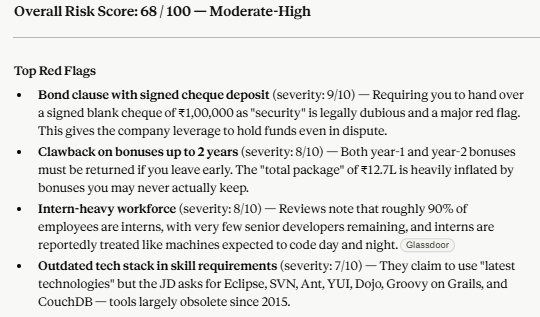
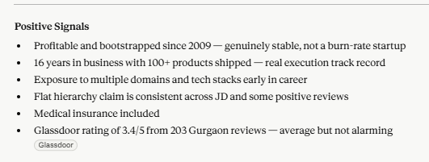
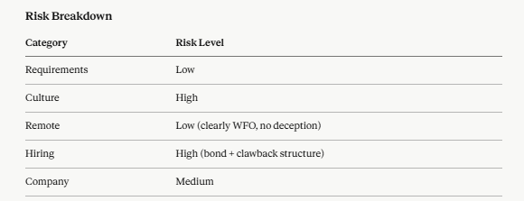
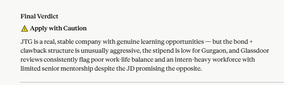
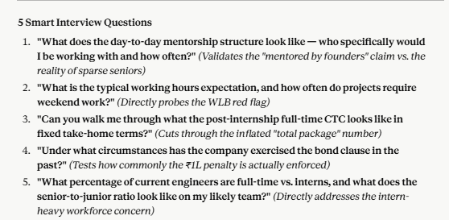

# Day 14 — AI Job Red Flag Detector

**Challenge:** ABTalks 60-Day Claude Challenge  
**Category:** Career Applications with Claude  
**Difficulty:** Beginner  
**Time:** 30 minutes  

---

## What I Built

An **AI Job Red Flag Detector** that analyzes job descriptions and company information to identify hidden risks before investing time in applying. The tool evaluates:

1. **Risk Detection** — Unrealistic requirements, contradictory expectations
2. **Toxic Workplace Signals** — Burnout culture, hustle indicators
3. **Remote Validation** — Misleading remote-work claims
4. **Hiring Risks** — Bond clauses, vague salary, suspicious practices
5. **Company Risks** — Stability, reputation, Glassdoor signals

---

## Job Analyzed

**Role:** Associate Software Developer (Fresher — 2027 Batch)  
**Company:** Josh Technology Group (JTG), Gurgaon  
**Type:** 12-month Internship → Full-time conversion  

---

## Risk Analysis Report

### Overall Risk Score: 68 / 100 — Moderate-High

---

### Top Red Flags

| Red Flag | Severity (1–10) |
|---|---|
| Bond clause requiring signed ₹1,00,000 cheque as security deposit | 9/10 |
| Bonus clawback for up to 2 years if you leave early | 8/10 |
| ~90% intern workforce, very few senior developers remaining (Glassdoor) | 8/10 |
| Outdated tech stack (SVN, Eclipse, Dojo, YUI, Groovy on Grails) despite "latest tech" claims | 7/10 |
| Poor work-life balance confirmed across multiple Glassdoor reviews | 7/10 |
| Stipend of ₹27,500/month is below market for Gurgaon in 2026 | 6/10 |
| "Best in industry salary" claim with no actual post-internship CTC disclosed | 5/10 |

---

### Positive Signals

- Bootstrapped and profitable since 2009 — genuine financial stability
- 16 years in business with 100+ products shipped across real domains
- Flat hierarchy and direct access to senior leadership (partially validated)
- Exposure to multiple tech stacks and product domains early in career
- Medical insurance included
- Glassdoor rating: 3.4/5 from 203 Gurgaon reviews — average, not alarming
- Clear joining date (June/July 2026) — no ambiguity on timeline

---

### Risk Breakdown

| Category | Risk Level |
|---|---|
| Requirements | Low |
| Culture | High |
| Remote | Low |
| Hiring | High |
| Company | Medium |

---

### Final Verdict

⚠️ **Apply with Caution**

JTG is a real, stable company with genuine learning opportunities for freshers. However, the bond structure (requiring a signed cheque) is legally aggressive and financially risky. The total package of ₹12,70,400 is heavily inflated by bonuses that are deferred, clawed back on exit, and contingent on performance ratings. Glassdoor reviews consistently flag poor work-life balance and a workforce dominated by interns with limited senior mentorship — directly contradicting the JD's promise of being "mentored by the best."

The role is worth considering **only if** you get clarity on the bond clause enforceability, actual working hours, and post-internship fixed CTC before signing.

---

### 5 Smart Interview Questions

1. **"What does the day-to-day mentorship structure look like — who specifically would I be working with and how often?"**  
   *(Validates the "mentored by founders" claim vs. the reality of sparse senior developers)*

2. **"What is the typical working hours expectation, and how often do projects require weekend or late-night work?"**  
   *(Directly probes the work-life balance red flag flagged repeatedly on Glassdoor)*

3. **"Can you walk me through what the post-internship full-time CTC looks like in fixed, take-home terms?"**  
   *(Cuts through the inflated total package number to understand real compensation)*

4. **"Under what circumstances has the company exercised the bond clause or encashed the security cheque in the past?"**  
   *(Tests how aggressively the ₹1L penalty is actually enforced)*

5. **"What percentage of current engineers are full-time employees vs. interns, and what is the senior-to-junior ratio on my likely team?"**  
   *(Directly addresses the intern-heavy workforce concern from reviews)*

---

## Key Learnings

### 1. The "total package" trick
Companies often headline an inflated CTC by bundling deferred bonuses, performance bonuses, and clawback-eligible amounts. Always break it down into **fixed monthly take-home** before comparing offers.

### 2. Bond clauses with signed cheques are a major red flag
Requiring a signed blank cheque as a security deposit is unusual and potentially enforceable in ways that could hurt you. Always consult a lawyer before signing such agreements — especially as a fresher.

### 3. Cross-check "culture" claims with Glassdoor
JTG's JD says "hierarchy doesn't exist" and promises mentorship from founders. Glassdoor reviews tell a different story — interns doing most of the work with limited senior guidance. Always triangulate JD claims against third-party reviews.

### 4. Tech stack consistency matters
A company claiming to use "latest technologies" while listing SVN, Eclipse, Dojo, and Groovy on Grails in required skills is a signal of disconnect between marketing language and actual day-to-day reality.

### 5. Claude as a pre-application research tool
Using Claude to analyze a JD + Glassdoor data before applying saves hours of post-application regret. The combination of structured prompt + real company data produces actionable insights in minutes.

---

## Prompt Used

```
You are an AI Red Flag Detector for job seekers.
Analyze the Job Description and Company Information.

Identify:
1. Unrealistic Requirements
2. Toxic Workplace Signals
3. Remote Job Authenticity
4. Hiring Risks
5. Company Risks

Output:
## Overall Risk Score (0-100)
### Top Red Flags (with severity 1-10)
### Positive Signals
### Risk Breakdown Table
### Final Verdict (Apply / Apply with Caution / Avoid)
### 5 Smart Interview Questions

Job Description: [paste here]
Company Information: [paste here]
```

---

## Tool Used

**Claude Sonnet 4.6** via claude.ai  
**Effort Level:** Low  
**Additional Research:** Glassdoor reviews for Josh Technology Group, Gurgaon

---












*ABTalks 60-Day Claude Challenge — Day 14 of 60*  
*#60DayClaudeChallenge @Anthropic @ABTalksOnAI @AnilBajpai*