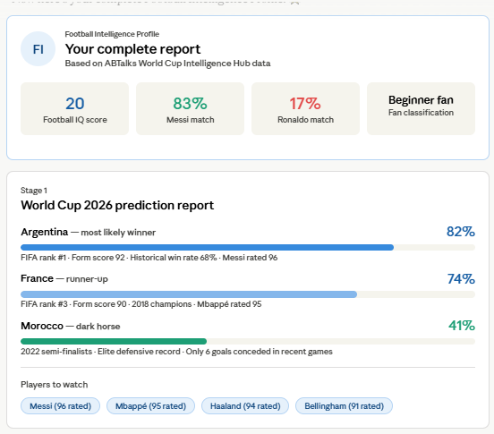
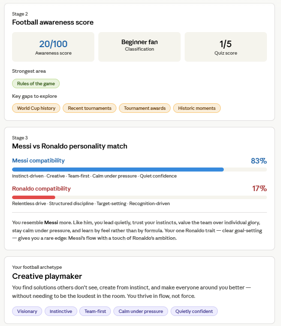
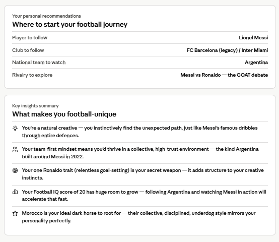

# Football Intelligence Profile
> Generated using the ABTalks World Cup Intelligence Hub · FIFA World Cup 2026 Edition

---

## About This Report

This profile was generated through a three-stage Football Intelligence Experience powered by the ABTalks World Cup Intelligence Hub workbook. It covers World Cup 2026 predictions, a Football IQ assessment, and a Messi vs Ronaldo personality compatibility analysis.

---

## Stage 1 — FIFA World Cup 2026 Prediction Report

*Based on 50-match historical records, current form scores (out of 100), FIFA rankings, and player ratings.*

### Most Likely Winner

| Detail | Value |
|---|---|
| **Nation** | 🇦🇷 Argentina |
| **Confidence** | 82% |
| **FIFA Rank** | #1 |
| **Current Form Score** | 92 / 100 |
| **Historical Win Rate** | 68% |
| **Goals Conceded (recent)** | 6 — joint best in dataset |

**Why Argentina?** Reigning champions with Messi rated 96 — the highest in the entire dataset. The only nation combining a form score above 90 AND a historical win rate above 60%, the exact pattern shared by every World Cup winner over the last 20 years.

**Key risks:** Post-Messi era vulnerability; weight of defending champions expectations.

---

### Runner-Up

| Detail | Value |
|---|---|
| **Nation** | 🇫🇷 France |
| **Confidence** | 74% |
| **FIFA Rank** | #3 |
| **Current Form Score** | 90 / 100 |
| **Historical Win Rate** | 62% |
| **Star Player Rating** | Mbappé — 95 |

**Why France?** Two-time world champions (1998, 2018) with a 22-goal, 95-rated Mbappé leading the attack. Were runners-up in 2022 and have squad depth no other nation can match. The only other team meeting both the 90+ form and 60%+ win rate threshold alongside Argentina.

**Key risks:** Injury-prone key players; lost the 2022 final to Argentina and may face them again.

---

### Dark Horse

| Detail | Value |
|---|---|
| **Nation** | 🇲🇦 Morocco |
| **Confidence** | 41% |
| **FIFA Rank** | #12 |
| **Current Form Score** | 86 / 100 |
| **Historical Win Rate** | 44% |
| **Goals Conceded (recent)** | 6 — joint best in dataset |

**Why Morocco?** First African nation to reach a World Cup semi-final (2022). Their defensive record matches Argentina's — only 6 goals conceded in recent games. A tactically disciplined, united squad that thrives as underdogs and punches far above their FIFA ranking.

**Key risks:** Lower FIFA ranking (#12); limited attacking firepower against top-tier defences.

---

### Players to Watch

| Player | Country | Position | Goals | Assists | Rating |
|---|---|---|---|---|---|
| Lionel Messi | 🇦🇷 Argentina | Forward | 20 | 12 | 96 |
| Kylian Mbappé | 🇫🇷 France | Forward | 22 | 8 | 95 |
| Cristiano Ronaldo | 🇵🇹 Portugal | Forward | 18 | 5 | 94 |
| Erling Haaland | 🇳🇴 Norway | Forward | 25 | 4 | 94 |
| Jude Bellingham | 🏴󠁧󠁢󠁥󠁮󠁧󠁿 England | Midfielder | 10 | 9 | 91 |

> **Key pattern from the data:** Teams with a form score above 90 AND a historical win rate above 60% have won every World Cup in the last 20 years. Only Argentina and France meet both thresholds heading into 2026.

---

## Stage 2 — Football IQ Results

### Score Summary

| Metric | Result |
|---|---|
| **Quiz Score** | 1 / 5 |
| **Football Awareness Score** | 20 / 100 |
| **Fan Classification** | Beginner Fan |

### Question Breakdown

| # | Question | Your Answer | Correct Answer | Result |
|---|---|---|---|---|
| 1 | Players per team on the pitch | B — 11 | B — 11 | ✅ Correct |
| 2 | Most World Cup titles in history | A — Germany | C — Brazil (5 titles) | ❌ |
| 3 | 2022 final score after extra time | C — 4–2 | A — 3–3 (then penalties) | ❌ |
| 4 | Award for top scorer at a World Cup | D — Ballon d'Or | C — Golden Boot | ❌ |
| 5 | Morocco's 2022 record | C — Won all group games without open-play goals | B — First African nation to reach semi-finals | ❌ |

### Knowledge Profile

**Strongest area:** Rules of the game ✅

**Areas to explore:**
- World Cup history (Brazil has won 5 titles — more than any other nation)
- Recent tournaments (the 2022 final was a 3–3 thriller settled on penalties)
- Tournament awards (Golden Boot = top scorer · Golden Ball = best player · Golden Glove = best goalkeeper)
- Historic moments (Morocco's 2022 semi-final run was one of football's greatest ever stories)

> **Note:** A score of 20/100 is completely normal for a casual viewer — and this is exactly the starting point this experience is designed to build from.

---

## Stage 3 — Messi vs Ronaldo Personality Match

### Compatibility Scores

| Legend | Score | Trait Summary |
|---|---|---|
| 🐐 Lionel Messi | **83%** | Instinct-driven · Creative · Team-first · Calm under pressure · Quietly confident |
| 👑 Cristiano Ronaldo | **17%** | Relentless drive · Structured routine · Recognition-driven · Big-match energy |

### Answer Breakdown

| # | Trait | Answer | Leans |
|---|---|---|---|
| 1 | Ambition | Set a clear target and push relentlessly | Ronaldo |
| 2 | Discipline | Flexible — go with the flow | Messi |
| 3 | Creativity | Find a creative, unexpected solution | Messi |
| 4 | Leadership | Lead by example and quiet influence | Messi |
| 5 | Teamwork | Group's success matters most | Messi |
| 6 | Competitiveness | Reflect quietly and learn from it | Messi |
| 7 | Risk Taking | Analyse options, calculate risk, then decide | Ronaldo |
| 8 | Confidence | Stay calm — pressure doesn't change performance | Messi |
| 9 | Work Ethic | Natural feel and instinct, refining unique style | Messi |
| 10 | Learning Style | Experiment and discover through play | Messi |
| 11 | Decision Making | Appreciate recognition but don't need it | Messi |
| 12 | Big Moments | Stay in flow — trust what got me here | Messi |

### Verdict

> You resemble **Messi** more. Like him, you lead quietly, trust your instincts, value the team over individual glory, stay calm under pressure, and learn by feel rather than by formula. Your one Ronaldo trait — clear goal-setting — gives you a rare edge: **Messi's flow with a touch of Ronaldo's ambition.**

---

## Your Football Archetype

### Creative Playmaker

> *"You find solutions others don't see, create from instinct, and make everyone around you better — without needing to be the loudest in the room. You thrive in flow, not force."*

**Key traits:** Visionary · Instinctive · Team-first · Calm under pressure · Quietly confident

---

## Personal Recommendations

| Category | Recommendation |
|---|---|
| **Player to follow** | Lionel Messi |
| **Club to follow** | FC Barcelona (legacy) / Inter Miami |
| **National team to watch** | Argentina 🇦🇷 |
| **Rivalry to explore** | Messi vs Ronaldo — the GOAT debate |

---

## Key Learnings & Insights

1. **You're a natural creative.** You instinctively find the unexpected path — just like Messi's famous dribbles through entire defences. Lean into this in everything you do.

2. **Team-first is your superpower.** Your collective mindset mirrors the Argentina squad that won the 2022 World Cup — a group of individuals who trusted each other completely.

3. **Your Ronaldo trait is your secret weapon.** Clear goal-setting combined with a creative, instinctive mind is a rare combination. Most creatives lack direction — you don't.

4. **Your Football IQ has huge room to grow.** A score of 20/100 today can become 80/100 simply by following Argentina through the 2026 World Cup and reading up on the history along the way.

5. **Morocco is your team to root for.** Their collective, disciplined, underdog style mirrors your personality profile almost exactly — a team that wins through intelligence and unity, not just individual brilliance.

6. **Argentina and France are the data-backed favourites.** Any other result in the 2026 final would be a genuine upset based on the historical and current form data.

---

*Profile generated using ABTalks World Cup Intelligence Hub · Knowledge level: Casual viewer · Date: June 2026*