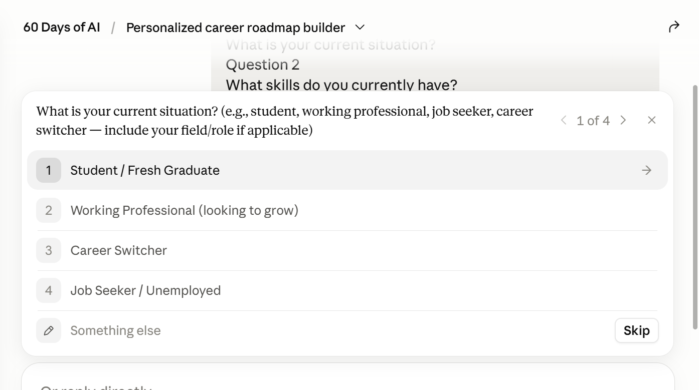
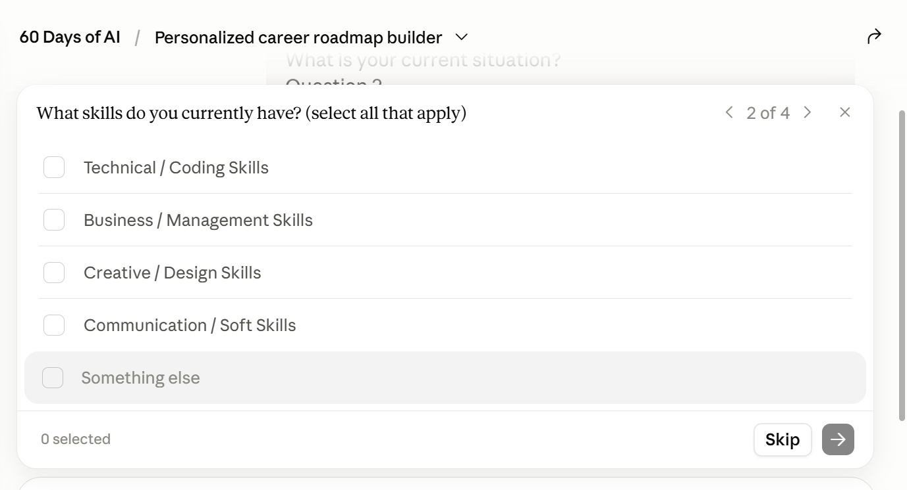
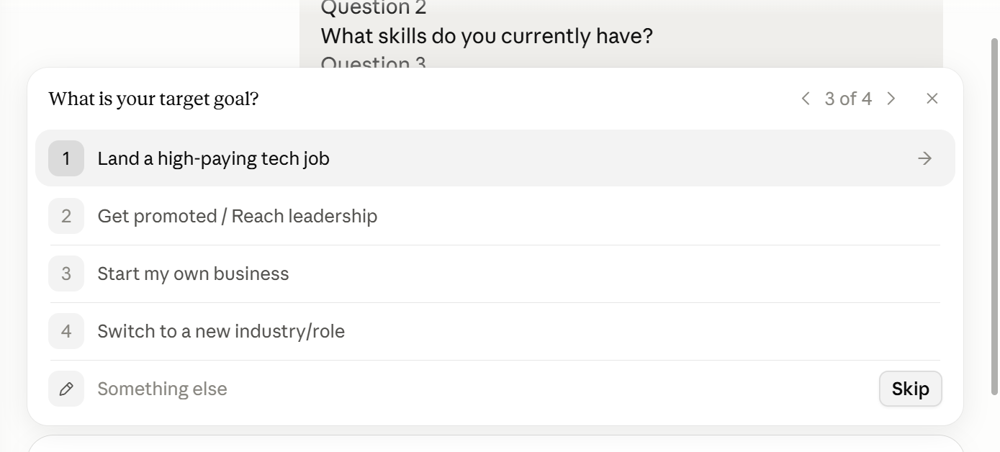
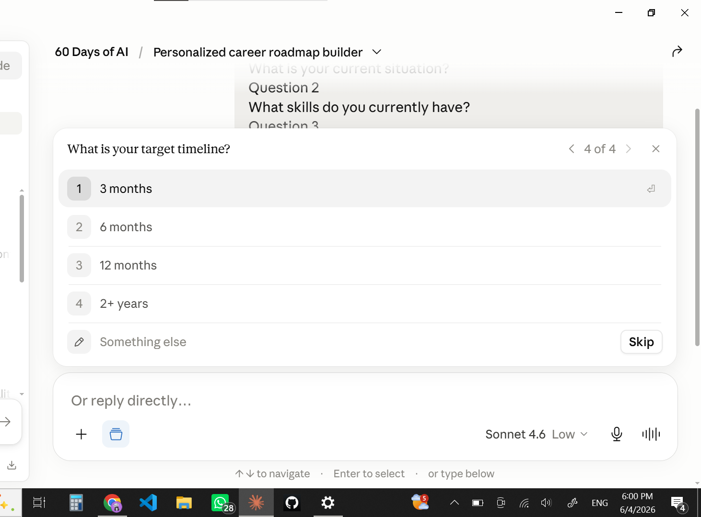
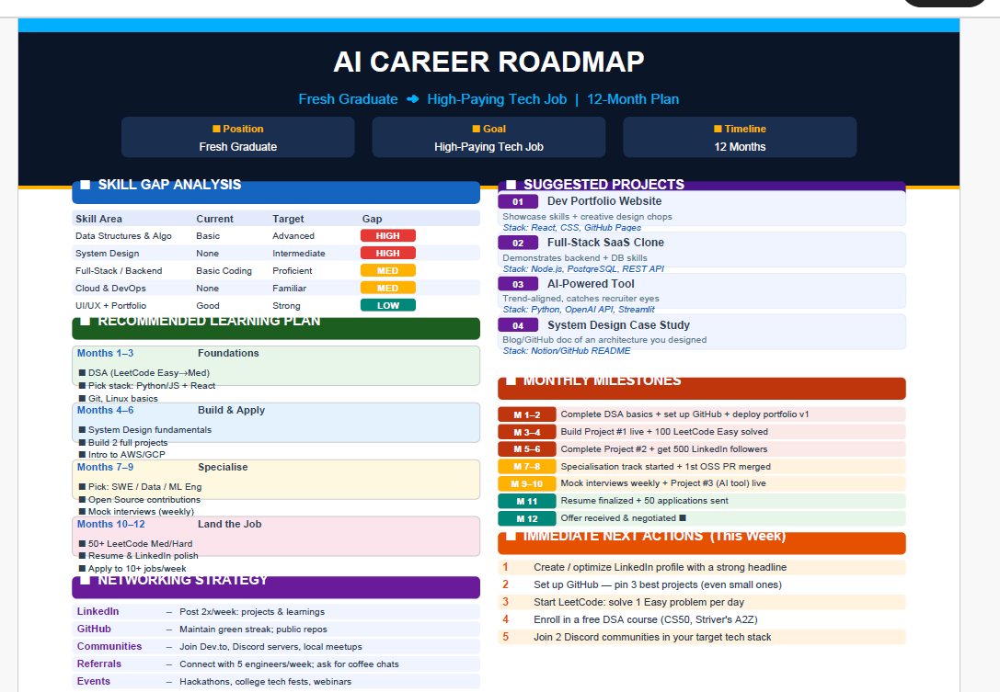

# Day 4 - Chain-of-Thought Prompting

## Objective

Learn how Chain-of-Thought (CoT) Prompting improves AI reasoning by encouraging the model to break a problem into logical steps before generating an answer.

---

## What is Chain-of-Thought Prompting?

Chain-of-Thought prompting is a prompt engineering technique that guides an AI model to reason through a problem step-by-step instead of jumping directly to a conclusion.

This approach often produces:

* More accurate outputs
* Better reasoning
* Improved decision-making
* More personalized recommendations

---

## Task Performed

I used Claude to generate a personalized career roadmap.

The model first gathered information about:

1. Current situation
2. Existing skills
3. Career goal
4. Timeline

After collecting the inputs, it analyzed strengths, identified skill gaps, recommended projects, suggested networking strategies, and generated a structured roadmap.

---

## Inputs Provided

### Current Situation

Final-year B.Tech CSE (AI & ML) student

### Existing Skills

* Python
* Java
* C++
* React
* Full Stack Development
* Git & GitHub
* Machine Learning Fundamentals
* Prompt Engineering
* Technical Writing
* LinkedIn Content Creation

### Career Goal

Secure a strong AI Engineer / Software Engineer role while building a standout portfolio.

### Timeline

3 Months

---

## Generated Roadmap

### Key Focus Areas

* DSA & Problem Solving
* System Design Fundamentals
* Cloud & DevOps Basics
* AI/ML Project Development
* Full Stack Project Deployment
* Interview Preparation
* Resume & LinkedIn Optimization

### Suggested Projects

1. AI Study Assistant / Document Q&A System
2. Collaborative Study Platform (DeepSpace-style project)
3. Full Stack SaaS Application
4. Cloud-Deployed Production Project

### Success Metrics

* 250+ DSA Problems Solved
* 2 High-Impact Projects Deployed
* 1 Cloud-Based Project Completed
* Interview-Ready Resume
* Multiple Mock Interviews Completed

---

## Key Learning

The most valuable lesson from today's exercise was that better reasoning still depends on better context.

When only broad information is provided, the AI generates a logical but generic plan. Once more detailed information about skills, projects, and goals is included, the roadmap becomes significantly more personalized and actionable.

This demonstrated an important principle:

**Better Context → Better Reasoning → Better Outputs**

---

## Observations

* Chain-of-Thought prompting makes AI reasoning more transparent.
* Breaking a problem into smaller steps improves output quality.
* AI can identify skill gaps and priorities effectively when given sufficient context.
* The quality of recommendations depends heavily on the quality of the information provided.

---

## Screenshots

### Questionnaire

### Generated Roadmap

### Claude Output

---

Generated using Chain-of-Thought Reasoning.
