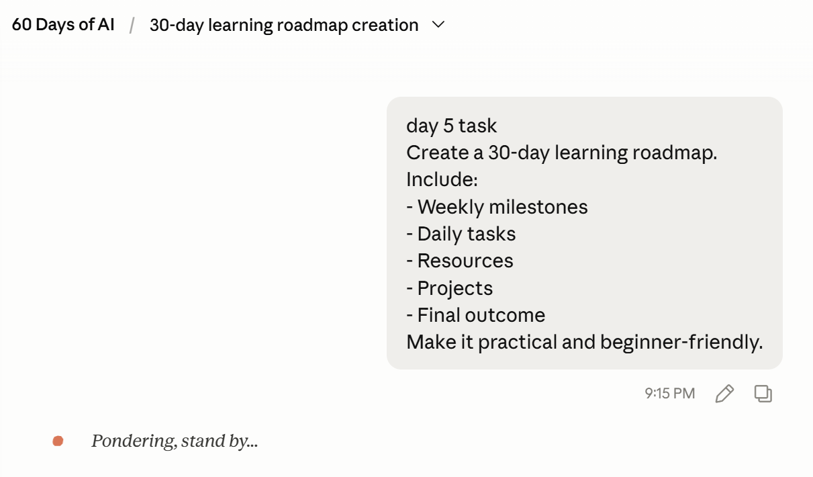
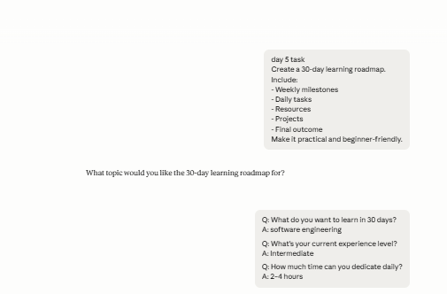
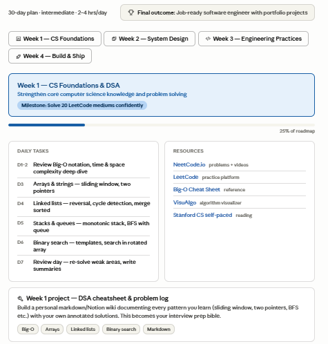
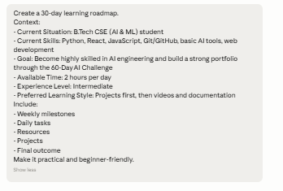
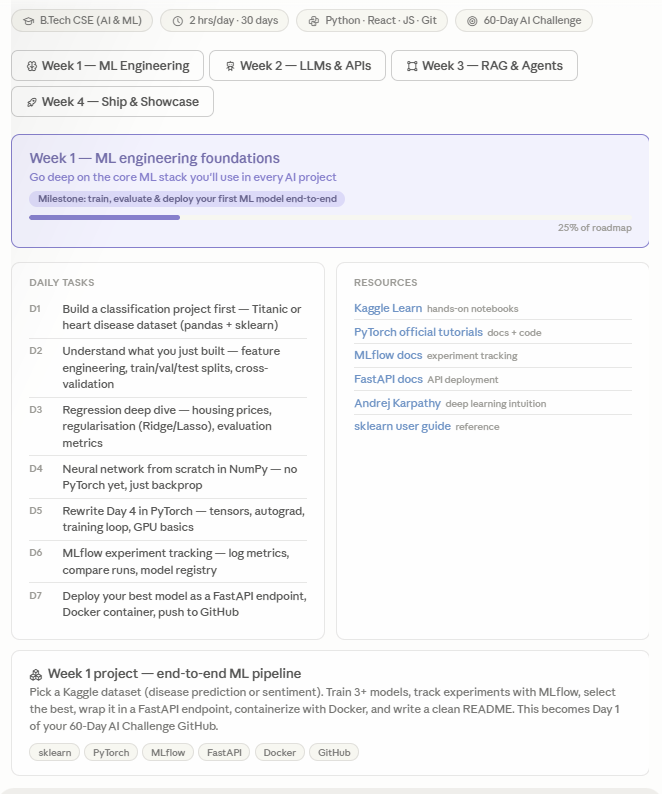

# Day 5 - Context Engineering

## Objective
Understand how adding context improves AI-generated outputs.

---

# Prompt A (Without Context)

## Prompt

## Output

---

# Prompt B (With Context)

## Prompt

## Output

---

# Comparison

## Which roadmap felt more personalized?
Prompt B because it considered my existing skills, available time, learning preferences, and career goals.

## Which roadmap would I actually follow?
Prompt B because it was aligned with my AI engineering journey and current challenge goals.

## What role did context play?
Context reduced assumptions and allowed the AI to generate a roadmap tailored to my background, constraints, and objectives.

---

# Key Learnings

- Context often matters more than prompt wording.
- AI performs better when given goals, constraints, and background information.
- Personalized outputs are more actionable than generic outputs.
- Context engineering is a core component of modern AI systems and agents.