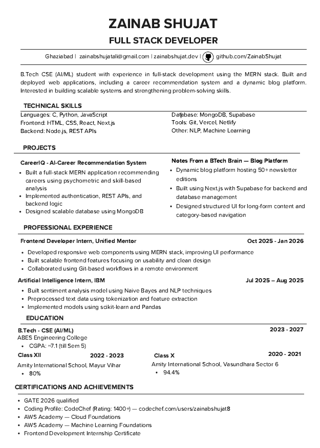
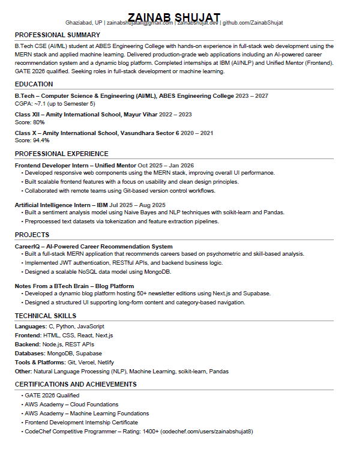
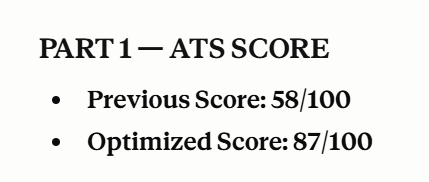

# Day 6 – ATS Resume Optimization

## Overview

On Day 6, I used an AI-powered ATS Resume Optimizer to analyze and rewrite my campus placement resume for maximum ATS (Applicant Tracking System) compatibility and recruiter readability.

---

## Original Resume

**File:** `zainab-Resume-campus-placements.pdf`

### Original Resume Details

| Field | Details |
|---|---|
| Format | Two-column layout with icons |
| Sections | Technical Skills, Projects, Experience, Education, Certifications |
| ATS Score | ~58/100 |

### Issues Identified in Original Resume

- Two-column layout causes ATS parsers to misread content order
- Icons and graphic elements are invisible or garbled by ATS
- No Professional Summary section — missed keyword opportunity
- Skills section missing key tool names (scikit-learn, Pandas, JWT, NoSQL)
- Section headings were non-standard (e.g. not recognized by all ATS systems)
- Weak or inconsistent use of action verbs
- Degree title abbreviated, not fully parsed by ATS

---

## Optimized Resume

**File:** `Zainab_Shujat_ATS_Resume.pdf`

### ATS Score Improvement

| Version | Score |
|---|---|
| Original | 58 / 100 |
| Optimized | 87 / 100 |

### Key Changes Made

1. **Added Professional Summary** — Keyword-rich paragraph at the top for faster ATS and recruiter scanning.
2. **Single-column layout** — Ensures correct left-to-right text parsing by all ATS systems.
3. **Removed icons and images** — Prevents garbled or missing characters in parsed output.
4. **Expanded Skills section** — Added `scikit-learn`, `Pandas`, `NLP`, `NoSQL`, `JWT authentication` — all drawn from existing experience bullets.
5. **Standardized section headings** — Used exact ATS-recognized labels.
6. **Stronger action verbs** — Consistent use of: Developed, Built, Implemented, Designed, Collaborated.
7. **Full degree title** — "Computer Science & Engineering (AI/ML)" spelled out completely.
8. **Reordered sections** — Education placed above Experience (standard for student/campus profiles).

---

## Screenshots







---

## Key Learnings

### What is ATS?
An **Applicant Tracking System (ATS)** is software used by recruiters to automatically scan, parse, and rank resumes before a human ever reads them. If your resume isn't formatted correctly, it may be filtered out even if you're qualified.

### Top ATS Optimization Lessons

- **Format matters as much as content.** A two-column resume with icons may look beautiful to a human but score poorly with ATS parsers.
- **Keywords are critical.** ATS systems match your resume against job descriptions. Skills and tools you *use* but don't *list* are invisible to the system.
- **Section headings must be standard.** Custom headings like "What I Know" won't be recognized — stick to EDUCATION, EXPERIENCE, SKILLS, etc.
- **Action verbs improve both ATS and readability.** Starting every bullet with a strong verb (Built, Developed, Implemented) signals impact and scannability.
- **A Professional Summary is not optional.** It's the first thing both ATS and recruiters see — it should contain your top keywords and role alignment.
- **Truthfulness is non-negotiable.** Never fabricate metrics or skills. Optimize *how* you present real experience, not *what* you claim.

### Personal Reflection

This exercise showed me that my resume had strong content but poor delivery. The two-column layout and icons that made it look polished were actually hurting my ATS score. Switching to a clean, single-column format and expanding my skills keywords pushed the score from 58 to 87 — a 29-point improvement — without changing a single fact about my experience.

Going forward, I will:
- Tailor my skills section keywords to each job description
- Keep my resume in single-column, plain-text-friendly format
- Update my CGPA and add project links (GitHub) before applying

---

## Tools Used

- **Claude (Anthropic)** — ATS Resume Optimizer
- **ReportLab (Python)** — PDF generation
- **Format:** A4, single-column, ATS-friendly

---

## Files in This Folder

```
Day6/
├── day6.md                          ← This file
├── zainab-Resume-campus-placements.pdf   ← Original resume
├── Zainab_Shujat_ATS_Resume.pdf     ← ATS-optimized resume
└── 
├── original_resume.png
├── optimized_resume.png
└── ats_score_comparison.png
```

---

*Day 6 of my placement preparation journey — learning that the best resume is one both humans and machines can read.*