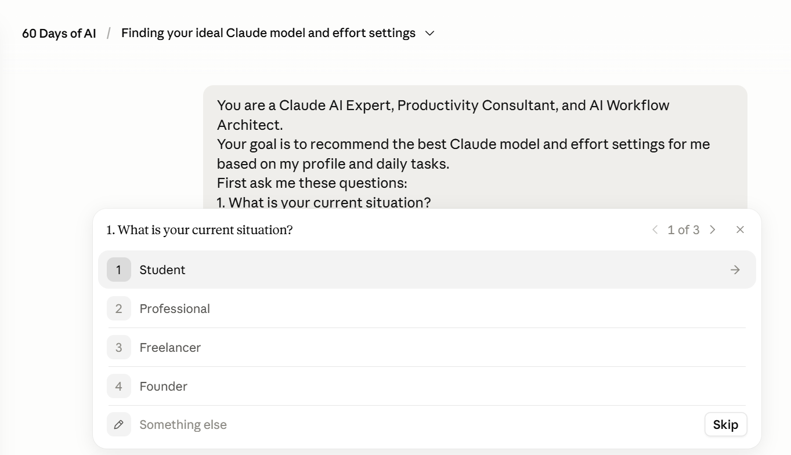
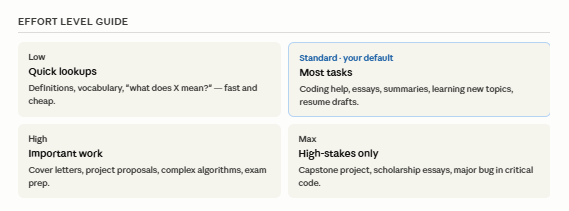
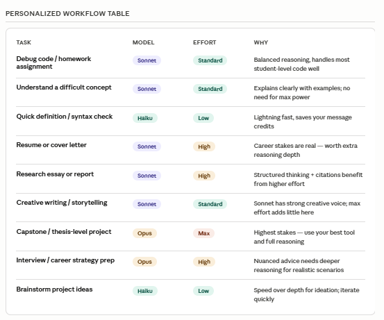
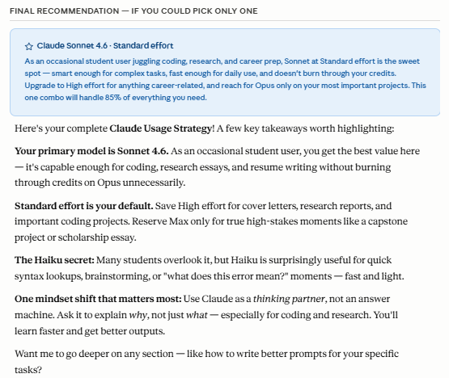

# Day 7 - Claude Model Selection & Reasoning Effort

## Challenge Objective

Today's goal was to understand how Claude's different models and reasoning effort settings should be used for different types of work.

Instead of assuming that the most powerful model is always the best choice, the challenge focused on selecting the right combination of model and effort level for a specific task.

---

## My Profile

### Current Situation

* Student

### Primary Activities

* Coding
* Content Creation
* Learning & Research
* Career Preparation
* Creative Work

### Most Common Outputs

* Learning Support
* Coding Help
* Deep Research

---

## My Personalized Claude Strategy

### Recommended Primary Model

**Claude Sonnet 4.6**

Claude identified Sonnet 4.6 as the best default model for my workflow because it balances intelligence, speed, and efficiency.

Since most of my work involves:

* Software development
* Technical learning
* Research
* Writing
* Career preparation

Sonnet provides enough capability without requiring the extra cost and reasoning depth of Opus for every task.

---

## Recommended Model Lineup

### Haiku 4.5

**Role:** Quick-answer sidekick

Best for:

* Definitions
* Quick syntax checks
* Short Q&A
* Simple fixes
* Fast brainstorming

### Sonnet 4.6

**Role:** Everyday workhorse

Best for:

* Coding projects
* Research
* Essays
* Learning
* Resume building
* Content creation

### Opus 4.6

**Role:** Deep-thinking specialist

Best for:

* Thesis-level work
* Complex debugging
* Strategic planning
* High-stakes decisions

---

## Recommended Effort Levels

### Low

Use for:

* Definitions
* Vocabulary
* Quick lookups
* Basic explanations

### Standard (Default)

Use for:

* Coding
* Essays
* Research
* Learning new concepts
* Resume drafts

This is the effort level I should use most often.

### High

Use for:

* Cover letters
* Research reports
* Complex algorithms
* Interview preparation

### Max

Use only for:

* Capstone projects
* Major academic work
* Scholarship applications
* Critical decisions

---

## My Personalized Workflow

| Task                     | Model  | Effort   |
| ------------------------ | ------ | -------- |
| Debug code / homework    | Sonnet | Standard |
| Learn difficult concepts | Sonnet | Standard |
| Quick definitions        | Haiku  | Low      |
| Resume writing           | Sonnet | High     |
| Research reports         | Sonnet | High     |
| Creative writing         | Sonnet | Standard |
| Thesis / Capstone work   | Opus   | Max      |
| Career strategy          | Opus   | High     |
| Idea brainstorming       | Haiku  | Low      |

---

## Biggest Mistakes To Avoid

### 1. Using Opus for Everything

More powerful does not automatically mean better.

For most student tasks, Sonnet is sufficient and significantly more efficient.

### 2. Running Max Effort Constantly

Max effort should be reserved for genuinely important work.

Standard effort handles the majority of daily tasks effectively.

### 3. Accepting the First Output

Claude works best as a collaborator.

Iterating and refining prompts often produces better results than switching models.

### 4. Writing Vague Prompts

Clear prompts improve output quality more than simply upgrading to a larger model.

### 5. Using Claude Only for Answers

Using Claude to explain concepts and reasoning processes leads to deeper learning.

---

## Key Takeaways

The biggest lesson from today's challenge was that model selection is a skill.

Before today, I would have assumed that the strongest model with the highest reasoning effort was always the correct choice.

Instead, I learned that:

* Start with Sonnet.
* Use Standard effort by default.
* Escalate only when necessary.
* Better prompts often matter more than bigger models.
* AI efficiency is about judgment, not maximum power.

---

## Final Recommendation

If I could only choose one combination:

**Claude Sonnet 4.6 + Standard Effort**

This setup covers most of my work as a Computer Science student, including coding, research, content creation, and career preparation.

It delivers strong results while remaining fast and efficient.

---
## Screenshots

### Profile Configuration

### Recommended Model Lineup

### Effort Level Guide

### Final Recommendation

---

## Reflection

Today's challenge changed how I think about AI usage.

The goal is not to use the smartest model possible.

The goal is to use the right model for the problem in front of you.

Just as developers choose different tools for different tasks, effective AI users choose different models depending on the level of reasoning actually required.
