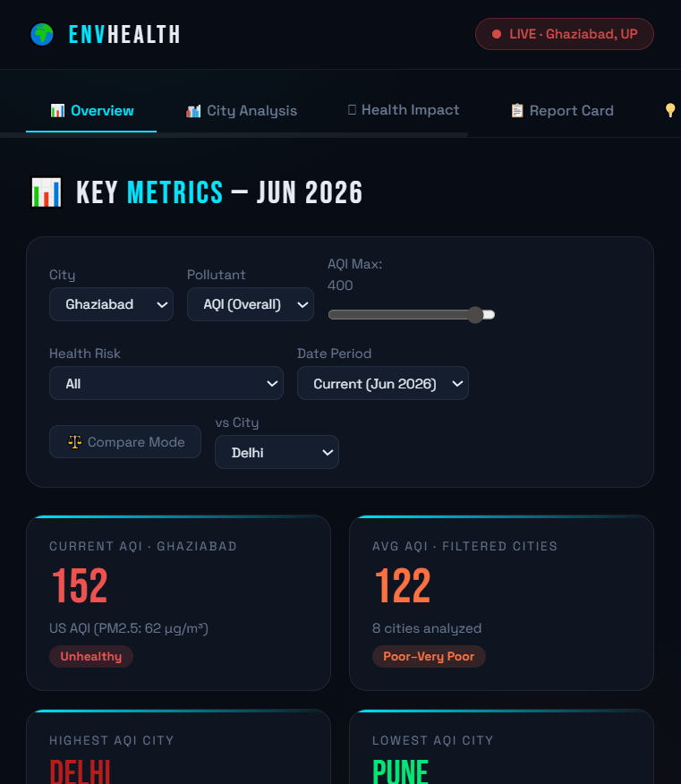

# Day 8 — Build Your First AI-Powered Dashboard

## What I Built
A fully interactive Personal Environmental Health Analyzer dashboard for Ghaziabad, UP.

## Screenshots

## Key Features
- Real AQI data for Ghaziabad (152 AQI, PM2.5: 62 µg/m³) sourced from CPCB/IQAir
- 5 standalone charts: AQI, PM2.5, PM10, City Ranking, Distribution
- Functional filters: city selector, pollutant toggle, AQI range, health risk, date period, compare mode
- Health impact analysis for lungs, sleep, energy, hair, skin
- Personal report card with grades (Air: F, Water: D)
- Personalized recommendations across 6 categories including outdoor activity guidance

## Key Learnings
- Claude can build full interactive HTML apps from a single detailed prompt
- Separating concerns (data, filters, charts) makes the output more maintainable
- Real data sourcing makes the dashboard genuinely useful vs. placeholder content

## Sources
- [AQI.in](https://www.aqi.in/us/dashboard/india/uttar-pradesh/ghaziabad)
- [AQICN / CPCB](https://aqicn.org)
- [IQAir](https://www.iqair.com/in-en/india/uttar-pradesh/ghaziabad)