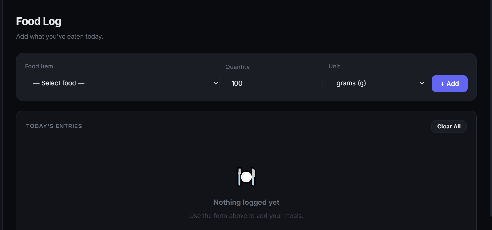
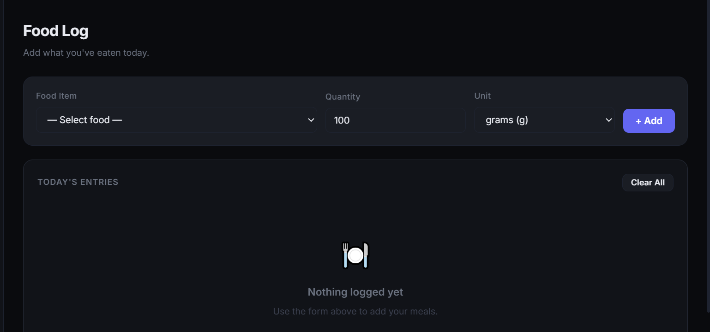
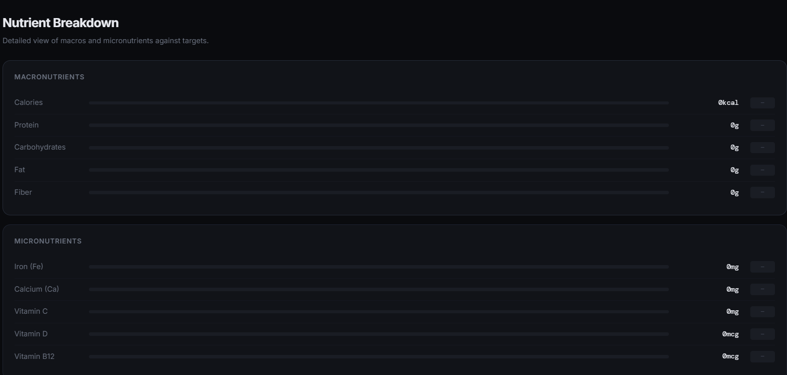
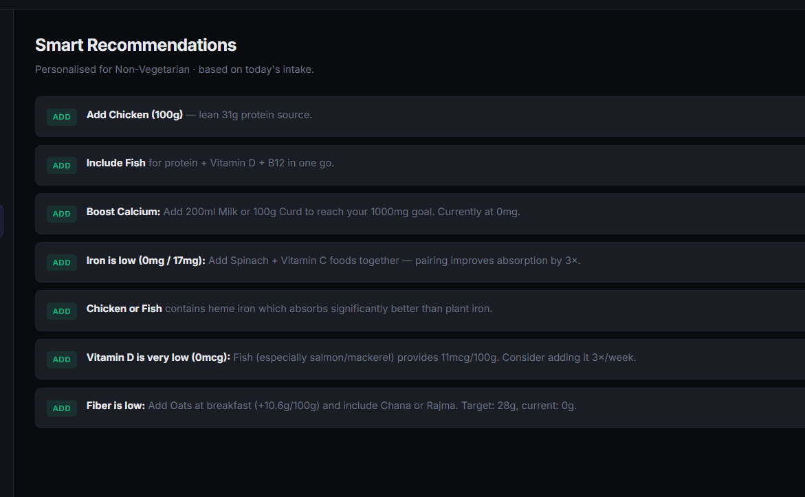
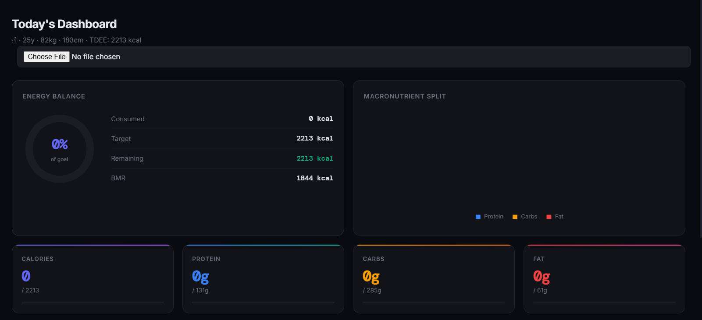
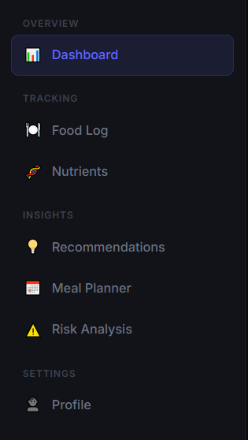
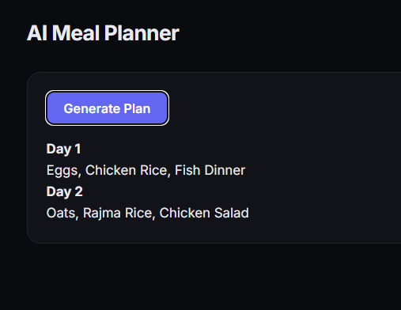
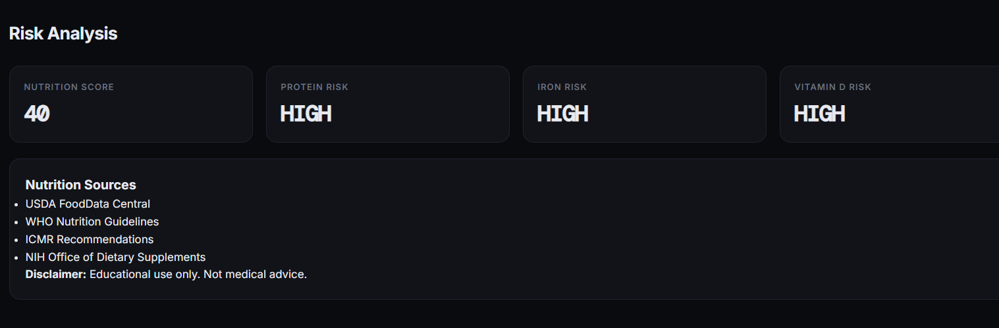

# Day 9 - Build & Enhance an AI Nutrition Analytics App

## Objective

Learn iterative AI application development by building an MVP first and then enhancing it through additional prompts and modifications.

---

# Project: NutriScope

NutriScope is a nutrition analytics web application that helps users track food intake, monitor macro and micronutrients, identify deficiencies, and receive personalized nutrition recommendations.

---

# MVP Version

## Features Implemented

### Profile Inputs

* Age
* Gender
* Height
* Weight
* Activity Level
* Dietary Preference

### Food Logging

* Add food entries
* Quantity selection
* Unit selection
* Editable food table
* Remove food entries

### Nutrition Tracking

Tracked:

* Calories
* Protein
* Carbohydrates
* Fat
* Fiber
* Iron
* Calcium
* Vitamin C
* Vitamin D
* Vitamin B12

### Analytics Dashboard

* Energy Progress Ring
* Macronutrient Chart
* Top Deficiencies
* Top Excesses
* Nutrient Breakdown Table

### Recommendations

* Food additions
* Food swaps
* Portion adjustments
* Diet-specific suggestions

### UI/UX

* Dark theme
* Mobile responsive
* Premium SaaS-style interface
* Single-file HTML application
* Local storage support

---

## MVP Screenshots

### Dashboard

### Food Log

### Nutrient Breakdown

### Recommendations

---

# Enhanced Version

## Additional Features Added

### Expanded Food Database

Added 40 additional food items including:

* Brown Rice
* Quinoa
* Sweet Potato
* Broccoli
* Carrot
* Beetroot
* Tofu
* Soy Chunks
* Almonds
* Walnuts
* Salmon
* Tuna
* Lentils
* Black Beans
* and more

### CSV Upload Support

* Import nutrition data through CSV files
* Faster food log population

### Additional Micronutrients

Added support for:

* Magnesium
* Potassium
* Zinc
* Sodium
* Folate
* Vitamin A
* Vitamin E
* Vitamin K

### Meal Planning

* 2-Day Meal Planner
* Breakfast, Lunch, and Dinner suggestions
* Diet-aware planning

### Risk Analysis

* Protein deficiency risk
* Iron deficiency risk
* Vitamin D deficiency risk
* Calorie imbalance detection
* Nutrition warning indicators

### Nutrition Sources

Integrated references from:

* USDA FoodData Central
* WHO Nutrition Guidelines
* ICMR Recommendations
* NIH Office of Dietary Supplements

### Educational Disclaimer

Added guidance clarifying:

* Educational purpose only
* Not medical advice
* Professional consultation recommended

### Enhanced Insights

* More detailed recommendations
* Expanded nutritional analysis
* Better decision support

---

## Enhanced Version Screenshots

### Enhanced Dashboard

### Enhanced Features

### Meal Planner

### Risk Analysis

---

# MVP vs Enhanced Comparison

| Feature                | MVP       | Enhanced     |
| ---------------------- | --------- | ------------ |
| Food Database          | 20 Foods  | 60 Foods     |
| CSV Upload             | ❌         | ✅            |
| Micronutrients         | Basic Set | Expanded Set |
| Meal Planner           | ❌         | ✅            |
| Risk Analysis          | ❌         | ✅            |
| Nutrition Sources      | ❌         | ✅            |
| Educational Disclaimer | ❌         | ✅            |
| Recommendations        | Basic     | Advanced     |
| Analytics              | Standard  | Enhanced     |

---

# Key Learnings

1. Building an MVP first makes AI-generated applications more reliable.
2. Iterative development improves quality significantly.
3. Smaller focused prompts produce better outputs than one massive prompt.
4. AI can rapidly generate working web applications when requirements are clearly defined.
5. Enhancing an existing application is often easier than generating a complete solution from scratch.
6. Product development follows an iterative cycle: Build → Test → Improve.
7. AI-assisted development still benefits from human review and refinement.

---

# Files Included

* NutriScope_MVP.html
* NutriScope_Final_V2.html
* Screenshots
* day9.md

---

# Reflection

Today's challenge demonstrated the importance of iterative AI development. Rather than attempting to build a complex application in a single step, creating an MVP first and then progressively enhancing it resulted in a more structured and manageable development process. This mirrors how real-world software products are often built and improved over time.

---
